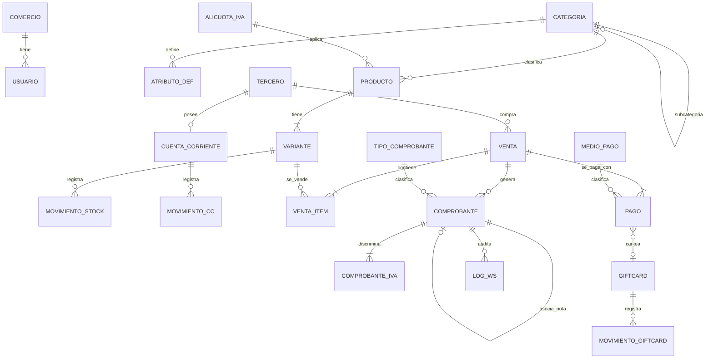

JJT MANAGER · DOCUMENTO DE GESTIÓN DE PROYECTOS

# **Modelo de Datos Genérico Multirubro**

Sistema de Gestión y Facturación Ágil integrado con ARCA

| Campo | Detalle |
| :---- | :---- |
| Código | JJT-GPI-15 |
| Actividad | 2.2 Modelo de datos genérico multirubro (Lista de Actividades v1.2) |
| Sponsor | Julio Gutierrez |
| Director de proyecto | Tomás Disandro |
| Fecha / Versión / Estado | 07/10/2026 · 1.1 · Aprobado por el equipo |

| Versión | Fecha | Cambios |
| :---- | :---- | :---- |
| 1.0 | 07/10/2026 | Borrador del modelo para la revisión 2.4. Emitido fuera del plazo previsto (semanas 3–4). |
| 1.1 | 07/10/2026 | Incorpora las observaciones O1 a O5 de la revisión 2.4 (JJT-GPI-16): cantidades decimales y unidad de medida, precio opcional por variante, venta sin cliente identificado, condición de IVA del emisor y precios con IVA incluido. Aprobado por el equipo el 07/10/2026. |

> Modelo de datos lógico del sistema, diseñado para que **ningún rubro esté en el esquema ni en el código**: categorías, atributos de variante, alícuotas de IVA, tipos de comprobante y medios de pago son datos configurables. Satisface RNF-01, RNF-02, RNF-03 y RF-32. Stack: PostgreSQL con Prisma (JJT-GPI-14).

## **1. Principios de diseño**

1. **El rubro es un conjunto de datos, no una estructura.** No existen tablas, columnas ni enumeraciones por rubro (RNF-01). «Kiosco» e «Indumentaria» son dos configuraciones: categorías y definiciones de atributos cargadas como datos (§5).
2. **Todo producto tiene al menos una variante.** Un producto sin talle, color ni presentación tiene una única variante implícita (`es_unica = true`). El stock, el precio de costo y el código de barras viven en la variante, de modo que el código de ventas, stock y reportes es el mismo para todos los rubros.
3. **Atributos de variante configurables** (RNF-02): una tabla define los atributos de cada categoría y la variante guarda los valores en una columna `JSONB` validada contra esa definición. No hay columnas `talle` ni `color`.
4. **IVA y tipos de comprobante parametrizables** (RNF-03): tablas de alícuotas y de tipos de comprobante, con el código de ARCA como dato.
5. **Los comprobantes autorizados son inmutables.** Una vez con CAE no se modifican ni se borran; se corrigen con notas de crédito o débito.
6. **Los saldos se derivan de movimientos.** Stock, cuenta corriente y giftcards guardan movimientos (libro mayor); el saldo es la suma, con un valor denormalizado verificado por transacción.
7. **Sin secretos en la base.** Certificados, claves y CUIT de ARCA se leen de variables de entorno (RNF-04); la base solo guarda el ticket de acceso temporal (WSAA) y el resultado de cada llamada, sin credenciales (RNF-05).
8. **Importes** como `NUMERIC(14,2)`; **cantidades** como `NUMERIC(12,3)`; **fechas** en UTC.

## **2. Diagrama entidad–relación**

## **3. Entidades**

### **3.1 Configuración y seguridad**

| Entidad | Campos principales | Notas |
| :---- | :---- | :---- |
| `comercio` | id, razón social, nombre de fantasía, **condición de IVA del emisor**, punto de venta, **precios_incluyen_iva** (booleano), ambiente ARCA (`homologacion` \| `produccion`) | Una sola fila (multi-sucursal está excluido). La condición de IVA decide qué tipos de comprobante puede emitir (RNF-03). El CUIT **no** se guarda aquí: viene de una variable de entorno. |
| `usuario` | id, nombre, correo, hash de contraseña (Argon2), rol (`administrador` \| `cajero`), activo | Roles básicos (RF-28 a RF-30). Los permisos se resuelven en el backend. |
| `alicuota_iva` | id, descripción, porcentaje, código ARCA, vigente | Datos, no constantes (RNF-03). |
| `tipo_comprobante` | id, descripción (Factura A/B/C, Nota de crédito A/B/C, Nota de débito A/B/C), código ARCA, requiere_receptor_identificado, discrimina_iva | Datos, no enumeración en código (RNF-03). |
| `medio_pago` | id, descripción, tipo (`efectivo` \| `tarjeta` \| `transferencia` \| `qr` \| `cuenta_corriente` \| `giftcard`), activo | RF-15. |

### **3.2 Catálogo y stock**

| Entidad | Campos principales | Notas |
| :---- | :---- | :---- |
| `categoria` | id, nombre, categoria_padre_id (nulo si es raíz), activa | Árbol definido por el usuario (RF-02). |
| `atributo_def` | id, categoria_id, nombre (p. ej. «Talle»), tipo (`texto` \| `numero` \| `lista` \| `booleano`), valores_permitidos (para `lista`), obligatorio, orden | Define qué atributos de variante tiene una categoría (RF-03, RNF-02). Las subcategorías heredan los de su padre. |
| `producto` | id, categoria_id, nombre, descripción, **unidad_medida** (`unidad` \| `kg` \| `g` \| `l` \| `m` …), alicuota_iva_id, activo | Atributos comunes (RF-01). La baja es lógica (`activo = false`) para conservar el historial. |
| `variante` | id, producto_id, **es_unica**, **atributos** (`JSONB`), código de barras, SKU, costo, precio_venta, **precio_propio** (booleano), stock_minimo, activa | `atributos` se valida contra `atributo_def`. Si `precio_propio` es falso, el precio efectivo es el del producto (campo `precio_base` en `producto`). Un producto sin variantes tiene una sola fila con `es_unica = true`. |
| `producto.precio_base` | NUMERIC(14,2) | Precio de venta por defecto (con IVA incluido si `comercio.precios_incluyen_iva`). |
| `movimiento_stock` | id, variante_id, fecha, tipo (`ingreso` \| `venta` \| `ajuste` \| `devolucion`), cantidad (con signo, NUMERIC(12,3)), **motivo** (obligatorio si tipo = `ajuste`), venta_id (opcional), usuario_id | Libro mayor de stock (RF-04). El stock actual de una variante es la suma de sus movimientos. |
| `variante.stock_actual` | NUMERIC(12,3) | Valor denormalizado, actualizado en la misma transacción que el movimiento; se concilia con la suma en las pruebas (PC-STK). |

El **stock mínimo** se define por variante (RF-05) y la alerta se calcula comparando `stock_actual` con `stock_minimo`.

### **3.3 Terceros y cuentas corrientes**

| Entidad | Campos principales | Notas |
| :---- | :---- | :---- |
| `tercero` | id, tipo (`cliente` \| `proveedor` \| `ambos`), razón social o nombre, tipo de documento (CUIT, CUIL, DNI), número de documento, condición frente al IVA, domicilio, correo, teléfono, activo | Clientes y proveedores en una sola entidad con datos fiscales (RF-12). |
| `cuenta_corriente` | id, tercero_id (único), **límite_crédito**, saldo (denormalizado) | Una por tercero, creada al habilitar crédito (RF-13). |
| `movimiento_cc` | id, cuenta_corriente_id, fecha, tipo (`debe` \| `haber`), importe, concepto, referencia (venta, comprobante o pago) | Historial y estado de cuenta en una fecha dada (RF-13, RF-14). |

### **3.4 Ventas, comprobantes y pagos**

| Entidad | Campos principales | Notas |
| :---- | :---- | :---- |
| `venta` | id, fecha, usuario_id, **tercero_id (nulo = consumidor final)**, total, estado (`abierta` \| `cobrada` \| `anulada`) | Una venta puede no tener cliente identificado. |
| `venta_item` | id, venta_id, variante_id, **cantidad NUMERIC(12,3)**, precio_unitario, alícuota aplicada, descuento | Copia el precio y la alícuota del momento. |
| `comprobante` | id, venta_id, tipo_comprobante_id, punto de venta, número, fecha, receptor (tipo y número de documento; para consumidor final se informa «sin identificar»), importe neto, importe IVA, total, **cae**, **vencimiento_cae**, estado (`pendiente` \| `autorizado` \| `rechazado`), comprobante_asociado_id (para notas de crédito y débito), ambiente (`homologacion` \| `produccion`) | Inmutable una vez autorizado (RF-06, RF-07). El número lo asigna ARCA a partir del último autorizado. |
| `comprobante_iva` | id, comprobante_id, alicuota_iva_id, base imponible, importe | Discriminación de IVA (Factura A/B). |
| `pago` | id, venta_id, medio_pago_id, importe, referencia (n.º de operación, cupón o comprobante), estado, giftcard_id (opcional) | Una venta tiene uno o más pagos (RF-15, RF-16); la suma de pagos debe igualar el total de la venta. |
| `log_ws` | id, fecha, servicio (`wsaa` \| `wsfev1`), operación, comprobante_id (opcional), resultado, código de error ARCA, mensaje | Sin certificados, claves ni tokens (RF-09, RF-10, RNF-05). |
| `ticket_wsaa` | id, servicio, token, sign, generado, expira | Caché del ticket de acceso (~12 h) para no reautenticar (actividad 4.1.2). Se lee solo desde el backend. |

### **3.5 Giftcards**

| Entidad | Campos principales | Notas |
| :---- | :---- | :---- |
| `giftcard` | id, **código único**, saldo (denormalizado), estado (`activa` \| `agotada` \| `anulada`), fecha de emisión | Emisión (RF-17) y consulta de saldo (RF-20). |
| `movimiento_giftcard` | id, giftcard_id, fecha, tipo (`emision` \| `recarga` \| `canje`), importe, pago_id (en canjes), usuario_id | Recarga (RF-18) y canje como medio de pago (RF-19). |

## **4. Reglas de integridad**

| N.º | Regla | Dónde se hace cumplir |
| :----: | :---- | :---- |
| 1 | Todo producto tiene al menos una variante; si `es_unica`, no puede haber otra. | Servicio de catálogo + restricción de unicidad parcial |
| 2 | `variante.atributos` solo puede contener atributos definidos en la categoría del producto (o sus ancestras), con el tipo y los valores permitidos. | Validación en el servicio antes de guardar |
| 3 | Un ajuste de stock exige `motivo`. | Restricción `CHECK` y servicio |
| 4 | `stock_actual` = suma de `movimiento_stock` de la variante; se actualiza en la misma transacción. | Transacción de base de datos |
| 5 | Una venta cobrada tiene pagos cuya suma iguala el total. | Servicio de ventas |
| 6 | El importe en cuenta corriente de una venta no puede exceder el límite de crédito disponible. | Servicio de cuentas corrientes (RF-13) |
| 7 | Un comprobante autorizado no se modifica ni se elimina; una corrección es una nota asociada. | Servicio de comprobantes + permisos de la base |
| 8 | Una nota de crédito o débito referencia un comprobante autorizado (`comprobante_asociado_id`). | Servicio de comprobantes (RF-07) |
| 9 | El canje de una giftcard no puede superar su saldo. | Servicio de giftcards + `CHECK` (saldo ≥ 0) |
| 10 | Los tipos de comprobante permitidos dependen de la condición de IVA del emisor y del receptor. | Datos en `tipo_comprobante` + servicio de facturación (RNF-03) |

## **5. Configuración de los dos rubros de referencia**

Los dos rubros de los criterios de éxito (CE-3) son **cargas de datos**, sin cambios de esquema ni de código:

| Elemento | Kiosco | Tienda de indumentaria |
| :---- | :---- | :---- |
| Categorías | Bebidas · Golosinas · Cigarrillos · Almacén · Fiambrería | Remeras · Pantalones · Calzado · Accesorios |
| `atributo_def` | Bebidas: «Presentación» (lista: 500 ml, 1,5 L, 2,25 L). Resto: ninguno. | Remeras y Pantalones: «Talle» (lista: S–XXL) y «Color» (texto). Calzado: «Talle» (número). |
| Variantes | Una sola por producto (`es_unica`), salvo bebidas con presentaciones. | Una por combinación talle × color. |
| Unidad de medida | `unidad`; fiambrería en `kg` | `unidad` |
| Precio | Precio base por producto, con IVA incluido | Precio base por producto; precio propio en variantes especiales |
| IVA | 21 % y 10,5 % según producto | 21 % |
| Stock mínimo | Por variante (p. ej. golosinas de alta rotación) | Por variante (talles de mayor rotación) |

## **6. Trazabilidad con los requerimientos**

| Requerimiento | Cubierto por |
| :---- | :---- |
| RF-01 a RF-05 | `producto`, `categoria`, `atributo_def`, `variante`, `movimiento_stock`, `stock_minimo` |
| RF-06 a RF-11 | `comprobante`, `comprobante_iva`, `tipo_comprobante`, `ticket_wsaa`, `log_ws`, `comercio.ambiente` |
| RF-12 a RF-14 | `tercero`, `cuenta_corriente`, `movimiento_cc` |
| RF-15 a RF-21 | `medio_pago`, `pago`, `giftcard`, `movimiento_giftcard` (pasarela simulada: servicio, sin tabla propia) |
| RF-22 a RF-27 | Consultas sobre `venta`, `venta_item`, `comprobante`, `pago`, `variante` y `movimiento_cc` (sin tablas propias) |
| RF-28 a RF-30 | `usuario.rol` |
| RF-31 | Cadena `producto` → `venta` → `comprobante` → `pago` → reportes |
| RF-32; RNF-01 a RNF-03 | Principios 1 a 4 y §5 |

## **7. Aprobación**

*Aprobado por el equipo el 07/10/2026 (v1.1). Firma y fecha de cada persona, a registrar en la tabla.*

| Rol | Nombre | Firma / Conformidad | Fecha |
| :---- | :---- | :---- | :---- |
| Director de proyecto y Backend | Tomás Disandro | | |
| Frontend | Juan Cruz Bulatovich | | |
| QA y QC | Jesus Manuel Martinez | | |
